```mermaid
graph TD
    %% 业务层
    Agent[Agent] --> Gateway
    User[User] --> Gateway
    MCP[MCP] --> Gateway
    Model[Model] --> Gateway

    %% 网关层
    OpenResty[OpenResty] --> Gateway
    Gateway --> gRPC[gRPC Services]

    %% gRPC 层ä¾èµ–
    gRPC --> Consul
    MinIO-gRPC --> MinIO
    DuckDB-gRPC --> MinIO
    MQTT-gRPC --> Mosquitto
    Loki-gRPC --> Loki
    Redis-gRPC --> Redis
    NATS-gRPC --> NATS
    Postgres-gRPC --> PostgreSQL
    Qdrant-gRPC --> Qdrant
    Neo4j-gRPC --> Neo4j

    %% 基础设施层
    Grafana --> Loki
```

# isA Cloud - 完整服务架构

本文档描述 isA Cloud 平台的完整服务架构和 Kubernetes 部署方案。

---

## 🏗️ 服务分层架构

```
┌─────────────────────────────────────────────────────────────┐
│                      业务应用层 (4个服务)                      │
│  Agent (8080) │ User (8201-8230) │ MCP (8081) │ Model (8082) │
└─────────────────────────────────────────────────────────────┘
                              ↓
┌─────────────────────────────────────────────────────────────┐
│                      网关层 (2个服务)                         │
│         OpenResty (80/443) │ Gateway (8000/8001)             │
└─────────────────────────────────────────────────────────────┘
                              ↓
┌─────────────────────────────────────────────────────────────┐
│                      gRPC 服务层 (9个服务)                     │
│  MinIO-gRPC │ DuckDB-gRPC │ MQTT-gRPC │ Loki-gRPC │         │
│  Redis-gRPC │ NATS-gRPC │ Postgres-gRPC │ Qdrant-gRPC │     │
│  Neo4j-gRPC                                                  │
└─────────────────────────────────────────────────────────────┘
                              ↓
┌─────────────────────────────────────────────────────────────┐
│                   基础设施层 (11个服务)                        │
│  Consul │ Redis │ MinIO │ NATS │ Mosquitto │ PostgreSQL │   │
│  Qdrant │ Neo4j │ Loki │ Grafana │ DuckDB                   │
└─────────────────────────────────────────────────────────────┘
```

---

## 📦 服务清单

### 1️⃣ 基础设施层 (11个服务)

| 服务 | 类型 | 端口 | 用途 | 状态 |
|------|------|------|------|------|
| **Consul** | StatefulSet | 8500, 8600 | 服务发现和配置中心 | ✅ 已创建 |
| **Redis** | StatefulSet | 6379 | 缓存和消息队列 | ✅ 已创建 |
| **MinIO** | StatefulSet | 9000, 9001 | 对象存储 (S3兼容) | ⏳ 待创建 |
| **NATS** | StatefulSet | 4222, 8222 | 消息流和JetStream | ⏳ 待创建 |
| **Mosquitto** | Deployment | 1883, 9001 | MQTT 消息代理 | ⏳ 待创建 |
| **PostgreSQL** | StatefulSet | 5432 | 关系数据库 | ⏳ 待创建 |
| **Qdrant** | StatefulSet | 6333, 6334 | 向量数据库 | ⏳ 待创建 |
| **Neo4j** | StatefulSet | 7474, 7687 | 图数据库 | ⏳ 待创建 |
| **Loki** | StatefulSet | 3100 | 日志聚合 | ⏳ 待创建 |
| **Grafana** | Deployment | 3000 | 监控仪表板 | ⏳ 待创建 |
| **DuckDB** | - | - | 分析数据库 (嵌入式) | N/A |

**资源需求** (基础设施层总计):
- CPU: ~4-6 cores
- Memory: ~10-12 GB
- Storage: ~100 GB (PersistentVolumes)

---

### 2️⃣ gRPC 服务层 (9个服务)

| 服务 | Deployment | 端口 | 依赖 | 状态 |
|------|-----------|------|------|------|
| **minio-grpc** | Deployment | 50051 | MinIO, Consul | ⏳ 待创建 |
| **duckdb-grpc** | Deployment | 50052 | MinIO, Loki, Consul | ⏳ 待创建 |
| **mqtt-grpc** | Deployment | 50053 | Mosquitto, Loki, Consul | ⏳ 待创建 |
| **loki-grpc** | Deployment | 50054 | Loki, Consul | ⏳ 待创建 |
| **redis-grpc** | Deployment | 50055 | Redis, Loki, Consul | ✅ 已创建 |
| **nats-grpc** | Deployment | 50056 | NATS, Redis, MinIO, Consul | ⏳ 待创建 |
| **postgres-grpc** | Deployment | 50061 | PostgreSQL, Consul | ⏳ 待创建 |
| **qdrant-grpc** | Deployment | 50062 | Qdrant, Consul | ⏳ 待创建 |
| **neo4j-grpc** | Deployment | 50063 | Neo4j, Consul | ⏳ 待创建 |

**特性**:
- 所有服务自动注册到 Consul
- 统一的 gRPC 健康检查
- 支持水平扩展 (2+ 副本)
- 日志输出到 Loki

**资源需求** (gRPC 层总计):
- CPU: ~2-3 cores
- Memory: ~4-6 GB

---

### 3️⃣ 网关层 (2个服务)

| 服务 | 类型 | 端口 | 用途 | 状态 |
|------|------|------|------|------|
| **OpenResty** | Deployment | 80, 443 | 边缘层 (Nginx + Lua) | ⏳ 待创建 |
| **Gateway** | Deployment | 8000, 8001 | 应用网关 (Go) | ⏳ 待创建 |

**功能**:
- OpenResty: SSL/TLS 终止、缓存、限流、安全防护
- Gateway: 路由、认证、授权、gRPC 代理、WebSocket

**资源需求** (网关层总计):
- CPU: ~2 cores
- Memory: ~2-4 GB

---

### 4️⃣ 业务应用层 (4个服务)

| 服务 | 类型 | 端口 | 语言 | 功能 | 状态 |
|------|------|------|------|------|------|
| **Agent** | Deployment | 8080 | Python | AI Agent 服务 | ⏳ 待创建 |
| **User** | Deployment | 8201-8230 | Python | 用户服务集群 (24个微服务) | ⏳ 待创建 |
| **MCP** | Deployment | 8081 | Python | Model Context Protocol | ⏳ 待创建 |
| **Model** | Deployment | 8082 | Python | AI 模型服务 | ⏳ 待创建 |

**User 服务端口映射**:
```
8201: Auth           8202: Account       8203: Session       8204: Authorization
8205: Audit          8206: Notification  8207: Payment       8208: Wallet
8209: Storage        8210: Order         8211: Task          8212: Organization
8213: Invitation     8214: Vault         8215: Product       8216: Billing
8217: Calendar       8218: Weather       8219: Album         8220: Device
8221: OTA            8222: Media         8223: Memory        8225: Telemetry
8230: Event
```

**资源需求** (业务层总计):
- CPU: ~8-12 cores
- Memory: ~16-24 GB

---

## 🔗 服务依赖关系

### 依赖图



### 启动顺序

1. **第一波** (无依赖):
   - Consul
   - Redis
   - MinIO
   - NATS
   - Mosquitto
   - PostgreSQL
   - Qdrant
   - Neo4j
   - Loki

2. **第二波** (依赖基础设施):
   - Grafana (依赖 Loki)

3. **第三波** (gRPC 服务):
   - 所有 gRPC 服务 (依赖对应的基础设施 + Consul)

4. **第四波** (网关):
   - Gateway (依赖 gRPC 服务)
   - OpenResty (依赖 Gateway)

5. **第五波** (业务应用):
   - Model (依赖 Gateway)
   - MCP (依赖 Model + Gateway)
   - User (依赖 Gateway)
   - Agent (依赖 Gateway + User + MCP + Model)

---

## 🌐 网络和服务发现

### Kubernetes DNS

所有服务通过 Kubernetes DNS 互相访问：
```
<service-name>.<namespace>.svc.cluster.local
```

示例：
```
redis.isa-cloud-staging.svc.cluster.local:6379
consul.isa-cloud-staging.svc.cluster.local:8500
```

### Consul 服务注册

所有服务自动注册到 Consul：
```yaml
environment:
  - CONSUL_ENABLED=true
  - CONSUL_HOST=consul.isa-cloud-staging.svc.cluster.local
  - CONSUL_PORT=8500
```

---

## 💾 存储需求

### PersistentVolume 需求

| 服务 | 存储大小 | 用途 | StorageClass |
|------|----------|------|--------------|
| Consul | 10 GB (×3) | 服务配置和状态 | local-path |
| Redis | 10 GB | 持久化数据 | local-path |
| MinIO | 50 GB | 对象存储 | local-path |
| NATS | 10 GB | JetStream 数据 | local-path |
| PostgreSQL | 20 GB | 关系数据 | local-path |
| Qdrant | 20 GB | 向量数据 | local-path |
| Neo4j | 20 GB | 图数据 | local-path |
| Loki | 20 GB | 日志数据 | local-path |
| Grafana | 5 GB | 仪表板配置 | local-path |
| DuckDB-gRPC | 10 GB | 分析数据 | local-path |

**总计**: ~200 GB (kind 本地开发)

---

## ⚙️ 配置管理

### ConfigMaps

每个服务使用 ConfigMap 管理配置：
```
base/infrastructure/<service>/configmap.yaml
base/grpc-services/<service>/configmap.yaml
base/gateway/configmap.yaml
base/applications/<service>/configmap.yaml
```

### Secrets

敏感信息使用 Kubernetes Secrets：
```yaml
apiVersion: v1
kind: Secret
metadata:
  name: <service>-secret
type: Opaque
data:
  password: <base64-encoded>
```

生产环境推荐使用 **External Secrets Operator** 从云端 Secret Manager 同步。

---

## 🔒 安全配置

### 网络策略

```yaml
apiVersion: networking.k8s.io/v1
kind: NetworkPolicy
metadata:
  name: default-deny-all
spec:
  podSelector: {}
  policyTypes:
  - Ingress
  - Egress
```

### Pod Security

```yaml
securityContext:
  runAsNonRoot: true
  runAsUser: 1000
  fsGroup: 1000
  readOnlyRootFilesystem: true
```

---

## 📊 监控和日志

### 日志流

```
所有服务 → Loki → Grafana
```

### 健康检查

所有服务配置：
- `livenessProbe`: 存活检查 (失败则重启)
- `readinessProbe`: 就绪检查 (失败则从负载均衡移除)

### 指标采集

- Consul 内置指标
- 自定义 Prometheus metrics 端点
- Grafana 仪表板可视化

---

## 🚀 部署工作流

### kind 本地部署

```bash
# 1. 创建集群
cd deployments/kubernetes/scripts
./kind-setup.sh

# 2. 构建并加载镜像 (分层构建)
./kind-build-load.sh
# 选择: 1) 全部服务 (推荐完整验证)
#       2) 仅基础设施
#       3) 仅 gRPC 服务
#       4) 自定义

# 3. 部署服务 (分层部署)
./kind-deploy.sh
# 选择部署层次

# 4. 验证
kubectl get pods -n isa-cloud-staging -w
```

### 分层部署策略

**阶段 1: 基础设施** (约 5-10 分钟)
```bash
kubectl apply -k base/infrastructure/
kubectl wait --for=condition=ready pod -l tier=infrastructure -n isa-cloud-staging --timeout=10m
```

**阶段 2: gRPC 服务** (约 3-5 分钟)
```bash
kubectl apply -k base/grpc-services/
kubectl wait --for=condition=ready pod -l tier=grpc-services -n isa-cloud-staging --timeout=5m
```

**阶段 3: 网关** (约 2-3 分钟)
```bash
kubectl apply -k base/gateway/
kubectl wait --for=condition=ready pod -l tier=gateway -n isa-cloud-staging --timeout=5m
```

**阶段 4: 业务应用** (约 3-5 分钟)
```bash
kubectl apply -k base/applications/
kubectl wait --for=condition=ready pod -l tier=applications -n isa-cloud-staging --timeout=5m
```

---

## 📈 资源总计

### 完整平台资源需求

| 层级 | CPU | Memory | Storage |
|------|-----|--------|---------|
| 基础设施 | 4-6 cores | 10-12 GB | 200 GB |
| gRPC 服务 | 2-3 cores | 4-6 GB | - |
| 网关 | 2 cores | 2-4 GB | - |
| 业务应用 | 8-12 cores | 16-24 GB | 20 GB |
| **总计** | **16-23 cores** | **32-46 GB** | **220 GB** |

### kind 集群建议配置

**Docker Desktop 设置**:
- CPU: 12-16 cores
- Memory: 24-32 GB
- Disk: 300 GB

**kind 节点配置**:
- 1 控制平面节点 (4 CPU / 8 GB)
- 3 工作节点 (4 CPU / 8 GB each)

---

## 🎯 下一步

1. ✅ **基础设施服务** - 补充缺失的 9 个服务 manifests
2. ✅ **gRPC 服务** - 补充缺失的 8 个服务 manifests
3. ✅ **网关层** - 创建 OpenResty 和 Gateway manifests
4. ✅ **业务应用** - 创建 Agent, User, MCP, Model manifests
5. ✅ **Kustomize 配置** - 更新 overlays 支持完整部署
6. ✅ **构建脚本** - 更新 kind-build-load.sh 包含所有服务
7. ✅ **文档** - 完善部署文档和故障排查指南

---

## 📚 参考资料

- [Kubernetes 文档](https://kubernetes.io/docs/)
- [Kustomize 文档](https://kustomize.io/)
- [kind 文档](https://kind.sigs.k8s.io/)
- [Consul on Kubernetes](https://www.consul.io/docs/k8s)
- [OpenResty](https://openresty.org/)

---

**更新时间**: 2025-11-01
**版本**: v1.0.0
**维护者**: isA Cloud Team
