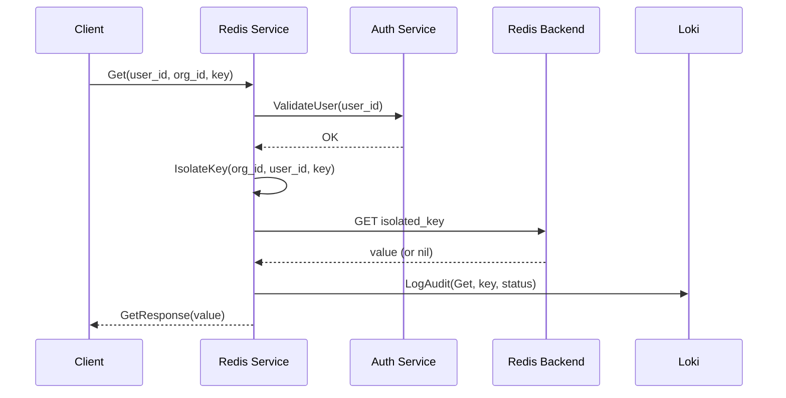
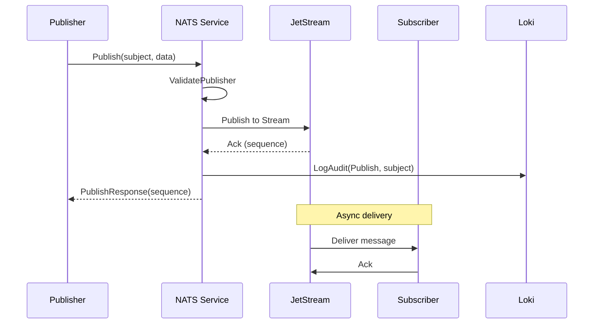
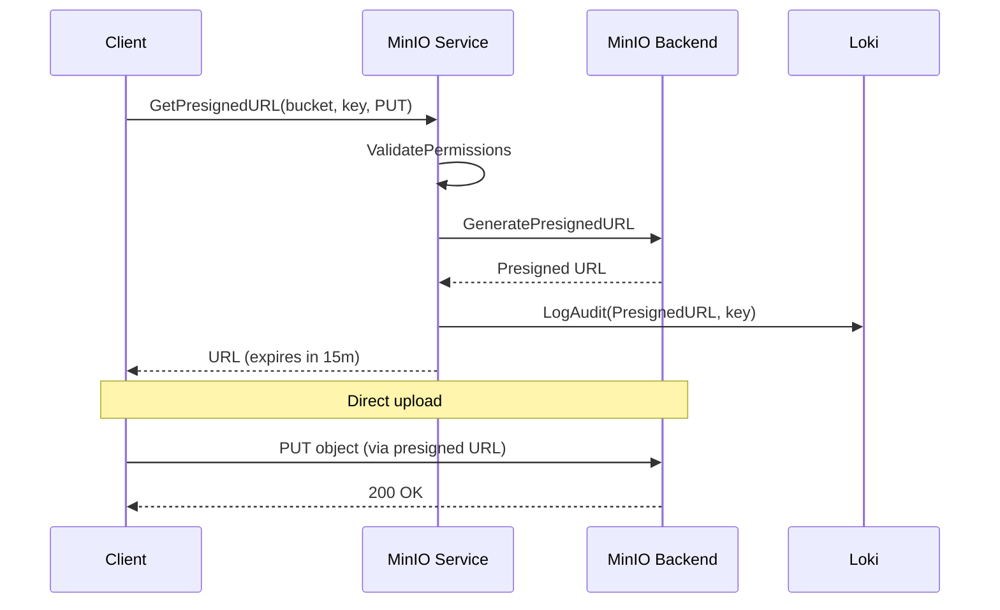

# isA Cloud Platform - Technical Design

> Architecture and Design Documentation for Infrastructure gRPC Services

---

## Overview

This document describes the technical architecture of isA Cloud's infrastructure services layer, providing a unified gRPC interface to various backend systems.

---

## High-Level Architecture

```
┌─────────────────────────────────────────────────────────────────────────────┐
│                              External Clients                                │
│                    (Agent, MCP, Model, User Services)                       │
└─────────────────────────────────────┬───────────────────────────────────────┘
                                      │
                                      │ gRPC (protobuf)
                                      ▼
┌─────────────────────────────────────────────────────────────────────────────┐
│                           API Gateway (APISIX)                               │
│                    - Routing, Rate Limiting, Auth                           │
└─────────────────────────────────────┬───────────────────────────────────────┘
                                      │
                    ┌─────────────────┼─────────────────┐
                    ▼                 ▼                 ▼
┌───────────────────────┐ ┌───────────────────┐ ┌───────────────────┐
│    Redis Service      │ │  Postgres Service │ │   NATS Service    │
│    (Port 50055)       │ │   (Port 50061)    │ │   (Port 50056)    │
└───────────┬───────────┘ └─────────┬─────────┘ └─────────┬─────────┘
            │                       │                     │
            ▼                       ▼                     ▼
┌───────────────────────┐ ┌───────────────────┐ ┌───────────────────┐
│       Redis           │ │    PostgreSQL     │ │       NATS        │
│    (Port 6379)        │ │   (Port 5432)     │ │   (Port 4222)     │
└───────────────────────┘ └───────────────────┘ └───────────────────┘
```

---

## Service Architecture

Each gRPC service follows Clean Architecture:

```
┌─────────────────────────────────────────────────────────────────┐
│                      gRPC Handler Layer                          │
│              (Request validation, Response mapping)              │
└───────────────────────────────┬─────────────────────────────────┘
                                │
                                ▼
┌─────────────────────────────────────────────────────────────────┐
│                       Service Layer                              │
│           (Business logic, Multi-tenancy, Audit)                │
└───────────────────────────────┬─────────────────────────────────┘
                                │
                                ▼
┌─────────────────────────────────────────────────────────────────┐
│                     Repository Layer                             │
│              (Data access abstraction)                          │
└───────────────────────────────┬─────────────────────────────────┘
                                │
                                ▼
┌─────────────────────────────────────────────────────────────────┐
│                   Infrastructure Layer                           │
│            (Redis client, PG driver, NATS client)               │
└─────────────────────────────────────────────────────────────────┘
```

---

## Component Design

### Redis Service

```
cmd/redis-service/
├── main.go                 # Entry point, DI setup
└── server/
    ├── server.go           # gRPC handler implementation
    └── auth.go             # Authentication logic

Internal Flow:
┌──────────┐     ┌──────────┐     ┌──────────┐     ┌──────────┐
│  Client  │────▶│  Auth    │────▶│ Isolate  │────▶│  Redis   │
│ Request  │     │ Validate │     │   Key    │     │  Client  │
└──────────┘     └──────────┘     └──────────┘     └──────────┘
                                        │
                                        ▼
                                 ┌──────────┐
                                 │  Audit   │
                                 │   Log    │
                                 └──────────┘
```

### PostgreSQL Service

```
cmd/postgres-service/
├── main.go
└── server/
    ├── server.go           # Query execution
    └── utils.go            # Result mapping

Query Flow:
┌──────────┐     ┌──────────┐     ┌──────────┐     ┌──────────┐
│  Query   │────▶│ Validate │────▶│ Execute  │────▶│  Return  │
│ Request  │     │  & Auth  │     │   SQL    │     │   JSON   │
└──────────┘     └──────────┘     └──────────┘     └──────────┘
```

### NATS Service

```
cmd/nats-service/
├── main.go
└── server/
    ├── server.go           # Pub/Sub, JetStream, KV
    └── auth.go             # Publisher/Subscriber auth

JetStream Flow:
┌──────────┐     ┌──────────┐     ┌──────────┐     ┌──────────┐
│ Publish  │────▶│  Stream  │────▶│ Consumer │────▶│ Deliver  │
│ Message  │     │  Store   │     │  Pull    │     │ to Sub   │
└──────────┘     └──────────┘     └──────────┘     └──────────┘
```

---

## Data Flow Diagrams

### Cache Read (Redis)



### Event Publish (NATS)



### Object Upload (MinIO)



---

## Multi-Tenancy Design

### Key Isolation Pattern

```go
// All keys are prefixed with org_id:user_id
func (s *Server) isolateKey(userID, orgID, key string) string {
    return fmt.Sprintf("%s:%s:%s", orgID, userID, key)
}

// Example transformations:
// Input:  key="session:token"
// Output: key="org-001:user-123:session:token"
```

### Database Isolation (PostgreSQL)

```sql
-- All queries filtered by organization
SELECT * FROM users
WHERE organization_id = $1
AND id = $2;

-- Schema per org (future)
SET search_path TO org_001;
```

### Bucket Isolation (MinIO)

```
Bucket naming convention:
{org_id}-{bucket_name}

Example:
org-001-uploads
org-001-exports
org-002-uploads
```

---

## Service Discovery

### Consul Registration

```go
// Each service registers with Consul on startup
registration := &consul.AgentServiceRegistration{
    ID:      fmt.Sprintf("%s-%s", serviceName, hostname),
    Name:    serviceName,
    Port:    grpcPort,
    Tags:    []string{"grpc", "infrastructure"},
    Check: &consul.AgentServiceCheck{
        GRPC:     fmt.Sprintf("%s:%d", hostname, grpcPort),
        Interval: "10s",
        Timeout:  "5s",
    },
}
```

### Service Mesh

```
┌─────────────────────────────────────────────────────────────────┐
│                           Consul                                 │
│                    (Service Registry)                           │
└───────────────────────────┬─────────────────────────────────────┘
                            │
            ┌───────────────┼───────────────┐
            ▼               ▼               ▼
    ┌───────────────┐ ┌───────────────┐ ┌───────────────┐
    │ redis-grpc    │ │ postgres-grpc │ │ nats-grpc     │
    │ 10.244.1.24   │ │ 10.244.2.27   │ │ 10.244.1.28   │
    └───────────────┘ └───────────────┘ └───────────────┘
```

---

## Error Handling

### gRPC Status Codes

| Scenario | gRPC Code | Description |
|----------|-----------|-------------|
| Invalid input | `InvalidArgument` | Missing/malformed fields |
| Auth failure | `PermissionDenied` | Invalid user/token |
| Not found | `NotFound` | Resource doesn't exist |
| Already exists | `AlreadyExists` | Duplicate resource |
| Backend error | `Internal` | Database/cache error |
| Timeout | `DeadlineExceeded` | Operation timed out |
| Unavailable | `Unavailable` | Backend unreachable |

### Error Response Pattern

```go
// Consistent error responses
func (s *Server) handleError(err error, operation string) error {
    // Log error
    s.logger.Error("operation failed",
        "operation", operation,
        "error", err,
    )

    // Map to gRPC status
    switch {
    case errors.Is(err, ErrNotFound):
        return status.Error(codes.NotFound, "resource not found")
    case errors.Is(err, ErrPermissionDenied):
        return status.Error(codes.PermissionDenied, "access denied")
    default:
        return status.Error(codes.Internal, "internal error")
    }
}
```

---

## Configuration

### Environment Variables

```bash
# Common
SERVICE_NAME=redis-grpc-service
GRPC_PORT=50055

# Consul
ISA_CLOUD_CONSUL_ENABLED=true
ISA_CLOUD_CONSUL_HOST=consul.isa-cloud-staging.svc.cluster.local
ISA_CLOUD_CONSUL_PORT=8500

# Loki (Audit)
LOKI_URL=http://loki.isa-cloud-staging.svc.cluster.local:3100

# Service-specific
ISA_CLOUD_REDIS_HOST=redis.isa-cloud-staging.svc.cluster.local
ISA_CLOUD_REDIS_PORT=6379
```

---

## Deployment

### Kubernetes Resources

```yaml
# Each service deployed as:
- Deployment (1-2 replicas for staging)
- Service (ClusterIP, gRPC port)
- ConfigMap (environment config)
- Secret (credentials, if needed)
```

### Resource Allocation (Staging)

| Service | CPU Request | Memory Request | Replicas |
|---------|-------------|----------------|----------|
| redis-grpc | 100m | 256Mi | 1 |
| postgres-grpc | 100m | 256Mi | 1 |
| nats-grpc | 100m | 256Mi | 1 |
| minio-grpc | 100m | 256Mi | 1 |
| qdrant-grpc | 100m | 256Mi | 1 |
| loki-grpc | 100m | 256Mi | 1 |

---

## Security

### Authentication Flow

```
┌──────────┐     ┌──────────┐     ┌──────────┐
│  Client  │────▶│ Gateway  │────▶│ Service  │
│          │     │ (Auth)   │     │          │
└──────────┘     └──────────┘     └──────────┘
     │                │                │
     │  JWT Token     │  Validated     │
     │  in metadata   │  user context  │
     └────────────────┴────────────────┘
```

### Data Protection

- All keys/data isolated by organization
- Audit logs for all operations
- No cross-tenant data access
- Secrets in Kubernetes Secrets

---

## Related Documents

- [Domain](../domain/README.md) - Business Context
- [PRD](../prd/README.md) - Product Requirements
- [CDD Guide](../cdd_guide.md) - Contract-Driven Development
- [Go Dev Guide](../GO_MICROSERVICE_DEVELOPMENT_GUIDE.md) - Implementation Guide

---

**Version**: 1.0.0
**Last Updated**: 2025-12-11
