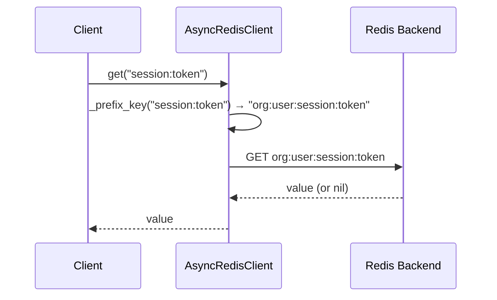
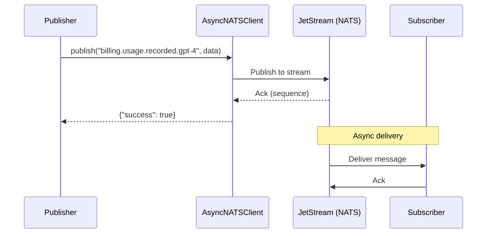
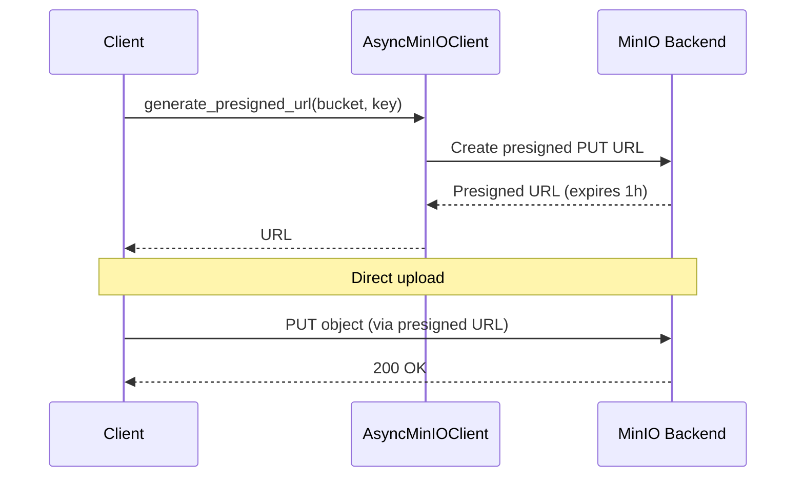

# isA Cloud Platform - Technical Design

> Architecture and Design Documentation for the isa_common Infrastructure SDK

---

## Overview

This document describes the technical architecture of isA Cloud's infrastructure layer. The platform provides **native async Python clients** that connect directly to backend services, plus Kubernetes deployment and service discovery infrastructure.

---

## High-Level Architecture

```
┌─────────────────────────────────────────────────────────────────────────────┐
│                              External Clients                                │
│                    (Agent, MCP, Model, User Services)                       │
└─────────────────────────────────────┬───────────────────────────────────────┘
                                      │
                                      │ import isa_common
                                      ▼
┌─────────────────────────────────────────────────────────────────────────────┐
│                        isa_common Python SDK                                 │
│              Native async clients (asyncpg, redis-py, nats-py, etc.)       │
└─────────────────────────────────────┬───────────────────────────────────────┘
                                      │
                    ┌─────────────────┼─────────────────┐
                    ▼                 ▼                 ▼
┌───────────────────────┐ ┌───────────────────┐ ┌───────────────────┐
│   AsyncRedisClient    │ │ AsyncPostgresClient│ │  AsyncNATSClient  │
│    (Port 6379)        │ │   (Port 5432)     │ │   (Port 4222)     │
└───────────┬───────────┘ └─────────┬─────────┘ └─────────┬─────────┘
            │                       │                     │
            ▼                       ▼                     ▼
┌───────────────────────┐ ┌───────────────────┐ ┌───────────────────┐
│       Redis           │ │    PostgreSQL     │ │       NATS        │
│    (Port 6379)        │ │   (Port 5432)     │ │   (Port 4222)     │
└───────────────────────┘ └───────────────────┘ └───────────────────┘
```

Clients connect **directly** to backend services on their native ports. There is no intermediate gRPC or proxy layer.

---

## Client Architecture

All async clients extend `AsyncBaseClient` and follow a consistent pattern:

```
┌─────────────────────────────────────────────────────────────────┐
│                      AsyncBaseClient                              │
│         (Abstract base: connect, disconnect, health_check)       │
└───────────────────────────────┬─────────────────────────────────┘
                                │ extends
                                ▼
┌─────────────────────────────────────────────────────────────────┐
│                    Concrete Client                                │
│         (AsyncRedisClient, AsyncPostgresClient, etc.)            │
│                                                                   │
│   _connect()       → Establish native driver connection          │
│   _disconnect()    → Close connection + pool cleanup             │
│   health_check()   → Backend health + connection stats           │
│   _prefix_key()    → Multi-tenant key isolation                  │
│   Domain methods   → Service-specific operations                 │
└─────────────────────────────────────────────────────────────────┘
```

### Key Design Patterns

1. **Lazy Connection**: Clients connect on first use (`_ensure_connected()`)
2. **Async Context Manager**: `async with client:` for lifecycle management
3. **Multi-Tenancy**: All keys/subjects auto-prefixed with `{org_id}{separator}{user_id}`
4. **Error Handling**: Standardized `handle_error(error, operation)` logging
5. **Configuration**: Environment variable defaults (`{PREFIX}_HOST`, `{PREFIX}_PORT`)

---

## Component Design

### Redis Client

```
isA_common/isa_common/async_redis_client.py (790 lines)

Data Flow:
┌──────────┐     ┌──────────┐     ┌──────────┐     ┌──────────┐
│  Client  │────▶│ Prefix   │────▶│  redis-py │────▶│  Redis   │
│  Call    │     │   Key    │     │  (async)  │     │  :6379   │
└──────────┘     └──────────┘     └──────────┘     └──────────┘

Tenant separator: ":" → org_id:user_id:key
Native driver: redis.asyncio
Features: strings, hashes, lists, sets, sorted sets, pub/sub, locks, sessions
```

### PostgreSQL Client

```
isA_common/isa_common/async_postgres_client.py (657 lines)

Query Flow:
┌──────────┐     ┌──────────┐     ┌──────────┐     ┌──────────┐
│  Query   │────▶│ Validate │────▶│  asyncpg  │────▶│ Postgres │
│ Request  │     │  Params  │     │  (pool)   │     │  :5432   │
└──────────┘     └──────────┘     └──────────┘     └──────────┘

Native driver: asyncpg
Features: query, execute, transactions, connection pooling, JSON/JSONB codecs
```

### NATS Client

```
isA_common/isa_common/async_nats_client.py (869 lines)

JetStream Flow:
┌──────────┐     ┌──────────┐     ┌──────────┐     ┌──────────┐
│ Publish  │────▶│  Stream  │────▶│ Consumer │────▶│ Deliver  │
│ Message  │     │  Store   │     │  Pull    │     │ to Sub   │
└──────────┘     └──────────┘     └──────────┘     └──────────┘

Tenant separator: "." → org_id.user_id.subject
Native driver: nats-py
Features: pub/sub, JetStream, KV store, object store, reconnection with observability
```

---

## Data Flow Diagrams

### Cache Read (Redis)


```mermaid
sequenceDiagram
    participant C as Client
    participant R as AsyncRedisClient
    participant Redis as Redis Backend

    C->>R: get("session:token")
    R->>R: _prefix_key("session:token") → "org:user:session:token"
    R->>Redis: GET org:user:session:token
    Redis-->>R: value (or nil)
    R-->>C: value
```

### Event Publish (NATS)


```mermaid
sequenceDiagram
    participant P as Publisher
    participant N as AsyncNATSClient
    participant JS as JetStream (NATS)
    participant S as Subscriber

    P->>N: publish("billing.usage.recorded.gpt-4", data)
    N->>JS: Publish to stream
    JS-->>N: Ack (sequence)
    N-->>P: {"success": true}

    Note over JS,S: Async delivery
    JS->>S: Deliver message
    S->>JS: Ack
```

### Object Upload (MinIO)


```mermaid
sequenceDiagram
    participant C as Client
    participant M as AsyncMinIOClient
    participant MinIO as MinIO Backend

    C->>M: generate_presigned_url(bucket, key)
    M->>MinIO: Create presigned PUT URL
    MinIO-->>M: Presigned URL (expires 1h)
    M-->>C: URL

    Note over C,MinIO: Direct upload
    C->>MinIO: PUT object (via presigned URL)
    MinIO-->>C: 200 OK
```

---

## Multi-Tenancy Design

### Key Isolation Pattern

```python
# All keys are prefixed with org_id + user_id via AsyncBaseClient._prefix_key()
# Each client uses a service-appropriate separator

# Redis (separator: ":")
"session:token" → "org-001:user-123:session:token"

# NATS (separator: ".")
"orders.created" → "org-001.user-123.orders.created"

# MQTT (separator: "/")
"devices/sensor1" → "org-001/user-123/devices/sensor1"

# MinIO (separator: "-")
"uploads" → "user-user-123-uploads"
```

### Database Isolation (PostgreSQL)

```sql
-- All queries filtered by organization
SELECT * FROM users
WHERE organization_id = $1
AND id = $2;
```

---

## Service Discovery

### Consul Registration

```python
# isa_common provides ConsulRegistry for service registration
from isa_common import ConsulRegistry, consul_lifespan

# FastAPI integration via lifespan
app = FastAPI(lifespan=consul_lifespan(
    app, service_name="my-service", service_port=8080
))

# Or manual registration
registry = ConsulRegistry(service_name="my-service", service_port=8080)
await registry.register()

# Service discovery with load balancing
endpoint = await registry.get_service_endpoint(
    "auth-service", strategy="health_weighted"
)
```

---

## Error Handling

### Standard Error Pattern

```python
# All clients use AsyncBaseClient.handle_error()
def handle_error(self, error: Exception, operation: str):
    self._logger.error(f"{self.SERVICE_NAME} {operation} failed: {error}")
```

### Common Exceptions

| Scenario | Exception | Description |
|----------|-----------|-------------|
| Connection failed | `ConnectionError` | Backend unreachable |
| Timeout | `TimeoutError` | Operation timed out |
| Not found | `KeyError` / custom | Resource doesn't exist |
| Auth failure | `PermissionError` | Invalid credentials |
| Backend error | `RuntimeError` | Internal backend error |

---

## Configuration

### Environment Variables

```bash
# Each client reads from env with a service-specific prefix
REDIS_HOST=localhost
REDIS_PORT=6379

POSTGRES_HOST=localhost
POSTGRES_PORT=5432
POSTGRES_USER=postgres
POSTGRES_PASSWORD=secret
POSTGRES_DB=mydb

NATS_HOST=localhost
NATS_PORT=4222

# Consul
CONSUL_HOST=localhost
CONSUL_PORT=8500
```

### Native Ports

```python
from isa_common import NATIVE_PORTS

# NATIVE_PORTS = {
#     'postgres': 5432,
#     'redis': 6379,
#     'neo4j': 7687,
#     'nats': 4222,
#     'qdrant': 6333,
#     'mqtt': 1883,
#     'minio': 9000,
#     'consul': 8500,
#     'duckdb': 0,  # Embedded
# }
```

---

## Related Documents

- [Domain](../domain/README.md) - Business Context
- [PRD](../prd/README.md) - Product Requirements
- [CDD Guide](../cdd_guide.md) - Contract-Driven Development

---

**Version**: 2.0.0
**Last Updated**: 2026-02-28
