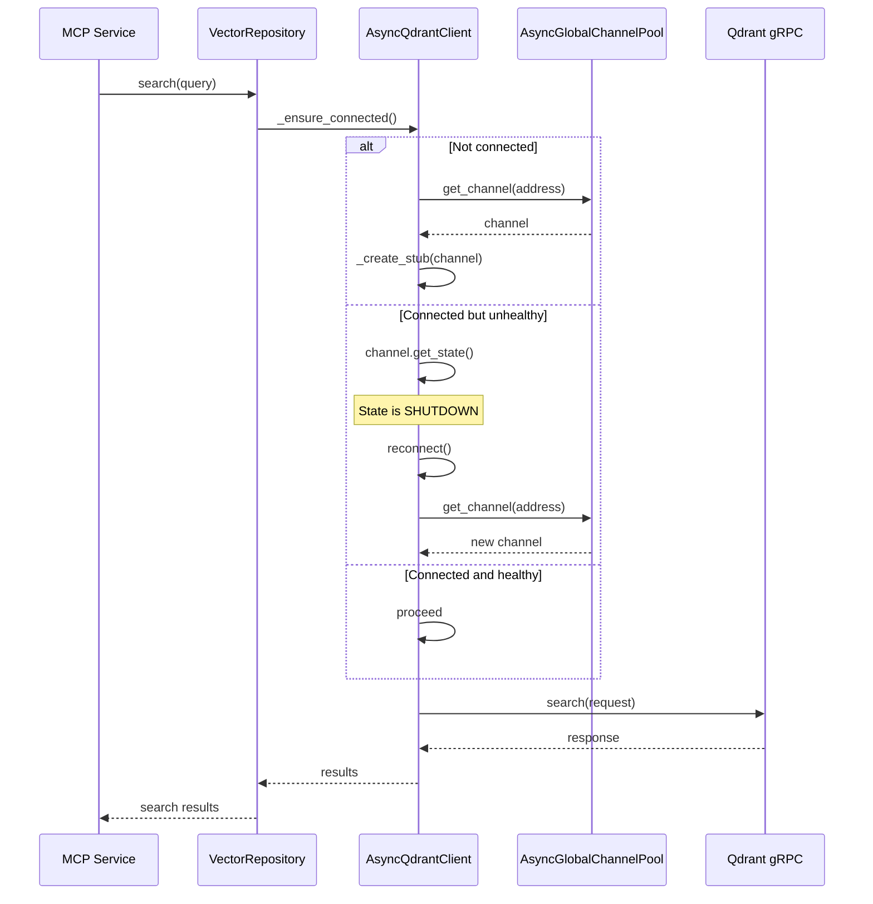

# ISA Common - Design Contract

**Technical Architecture for gRPC Client Infrastructure**

This document defines the technical architecture and design decisions for the `isa_common` gRPC client library.

---

## Architecture Overview

### High-Level Design

```
┌─────────────────────────────────────────────────────────────────────────────┐
│                      ISA COMMON ARCHITECTURE                                 │
├─────────────────────────────────────────────────────────────────────────────┤
│                                                                             │
│  Consumer Services (MCP, Model, User, Cloud)                                │
│         │                                                                   │
│         ▼                                                                   │
│  ┌──────────────────────────────────────────────────────────────────────┐  │
│  │                    Service-Specific Clients                           │  │
│  │  ┌──────────┐ ┌──────────┐ ┌──────────┐ ┌──────────┐ ┌──────────┐   │  │
│  │  │ Qdrant   │ │ Postgres │ │  Redis   │ │  MinIO   │ │  Neo4j   │   │  │
│  │  │ Client   │ │  Client  │ │  Client  │ │  Client  │ │  Client  │   │  │
│  │  └────┬─────┘ └────┬─────┘ └────┬─────┘ └────┬─────┘ └────┬─────┘   │  │
│  └───────┴────────────┴────────────┴────────────┴────────────┴──────────┘  │
│                                    │                                        │
│                                    ▼                                        │
│  ┌──────────────────────────────────────────────────────────────────────┐  │
│  │                     AsyncBaseGRPCClient                               │  │
│  │  ┌────────────────┐ ┌────────────────┐ ┌────────────────┐            │  │
│  │  │ _ensure_       │ │ is_channel_    │ │   reconnect()  │            │  │
│  │  │ connected()    │ │ healthy()      │ │                │            │  │
│  │  └────────────────┘ └────────────────┘ └────────────────┘            │  │
│  └──────────────────────────────────────┬───────────────────────────────┘  │
│                                         │                                   │
│                                         ▼                                   │
│  ┌──────────────────────────────────────────────────────────────────────┐  │
│  │                    AsyncGlobalChannelPool                             │  │
│  │  ┌────────────────────────────────────────────────────────────────┐  │  │
│  │  │  _pools: Dict[str, grpc.aio.Channel]                           │  │  │
│  │  │  ┌──────────────────┐ ┌──────────────────┐ ┌────────────────┐  │  │  │
│  │  │  │ qdrant:50062     │ │ postgres:50061   │ │ redis:50055    │  │  │  │
│  │  │  └──────────────────┘ └──────────────────┘ └────────────────┘  │  │  │
│  │  └────────────────────────────────────────────────────────────────┘  │  │
│  └──────────────────────────────────────────────────────────────────────┘  │
│                                         │                                   │
│                                         ▼                                   │
│                              gRPC Infrastructure                            │
│                                                                             │
└─────────────────────────────────────────────────────────────────────────────┘
```

---

## Component Design

### 1. AsyncBaseGRPCClient (Abstract Base Class)

**Location**: `isa_common/async_base_client.py`

**Responsibilities**:
- Connection lifecycle management
- Channel health checking
- Reconnection logic
- Pool integration

**Key Methods**:

```python
class AsyncBaseGRPCClient(ABC):
    """Abstract base for all async gRPC clients"""

    # === Connection Management ===
    async def _ensure_connected(self):
        """
        Ensure connection is established and healthy.

        Flow:
        1. If not connected → connect
        2. If connected but unhealthy → reconnect
        3. If connected and healthy → proceed
        """
        pass

    async def reconnect(self):
        """Force reconnection (creates new channel)"""
        pass

    async def close(self):
        """Close client (reset state, pool manages channel)"""
        pass

    # === Health Checking ===
    def is_channel_healthy(self) -> bool:
        """Check if channel is in healthy state (read-only)"""
        pass

    # === Abstract Methods (subclass must implement) ===
    @abstractmethod
    def service_name(self) -> str:
        """Return service name for logging"""
        pass

    @abstractmethod
    def _create_stub(self, channel):
        """Create service-specific stub"""
        pass
```

**State Diagram**:

```
                      ┌─────────────────────┐
                      │    DISCONNECTED     │
                      │  _connected=False   │
                      │    channel=None     │
                      └──────────┬──────────┘
                                 │
                    _ensure_connected()
                                 │
                                 ▼
                      ┌─────────────────────┐
                      │     CONNECTING      │
                      │  _connect_lock held │
                      └──────────┬──────────┘
                                 │
                         pool.get_channel()
                                 │
                                 ▼
            ┌────────────────────┴────────────────────┐
            │                                         │
            ▼                                         ▼
  ┌─────────────────────┐               ┌─────────────────────┐
  │      CONNECTED      │               │    CONNECTION       │
  │  _connected=True    │               │      FAILED         │
  │  channel=healthy    │               │                     │
  └──────────┬──────────┘               └─────────────────────┘
             │
      channel becomes unhealthy
             │
             ▼
  ┌─────────────────────┐
  │  NEEDS_RECONNECT    │
  │  channel=SHUTDOWN   │
  │     or              │
  │  TRANSIENT_FAILURE  │
  └──────────┬──────────┘
             │
      _ensure_connected() detects
             │
             ▼
  ┌─────────────────────┐
  │    RECONNECTING     │
  │  await reconnect()  │
  └──────────┬──────────┘
             │
             ▼
  ┌─────────────────────┐
  │      CONNECTED      │
  │  new healthy channel│
  └─────────────────────┘
```

---

### 2. AsyncGlobalChannelPool (Singleton)

**Location**: `isa_common/async_grpc_pool.py`

**Responsibilities**:
- Manage shared gRPC channels
- Provide channel reuse across clients
- Handle channel lifecycle

**Design Pattern**: Singleton with async-safe lazy initialization

```python
class AsyncGlobalChannelPool:
    """Singleton pool managing gRPC channels"""

    _instance: Optional['AsyncGlobalChannelPool'] = None
    _lock: asyncio.Lock = asyncio.Lock()

    @classmethod
    async def get_instance(cls) -> 'AsyncGlobalChannelPool':
        """Get or create singleton instance (async-safe)"""
        pass

    async def get_channel(self, address: str) -> grpc.aio.Channel:
        """Get or create channel for address"""
        pass

    async def close_all(self):
        """Close all channels on shutdown"""
        pass
```

**Pool Structure**:

```
AsyncGlobalChannelPool (Singleton)
│
├── _pools: Dict[str, grpc.aio.Channel]
│   ├── "qdrant:50062" → Channel
│   ├── "postgres:50061" → Channel
│   ├── "redis:50055" → Channel
│   └── ...
│
└── _lock: asyncio.Lock (for thread-safe access)
```

---

### 3. Service-Specific Clients

Each infrastructure service has a dedicated client that extends `AsyncBaseGRPCClient`:

| Client | Service | File |
|--------|---------|------|
| `AsyncQdrantClient` | Vector search | `async_qdrant_client.py` |
| `AsyncPostgresClient` | SQL database | `async_postgres_client.py` |
| `AsyncRedisClient` | Cache | `async_redis_client.py` |
| `AsyncMinioClient` | Object storage | `async_minio_client.py` |
| `AsyncNeo4jClient` | Graph database | `async_neo4j_client.py` |
| `AsyncDuckDBClient` | Analytics | `async_duckdb_client.py` |
| `AsyncLokiClient` | Logging | `async_loki_client.py` |
| `AsyncNatsClient` | Messaging | `async_nats_client.py` |
| `AsyncMqttClient` | IoT | `async_mqtt_client.py` |

---

## Key Algorithms

### Algorithm 1: _ensure_connected() (Fixed Version)

```python
async def _ensure_connected(self):
    """
    Ensure connection is established and healthy.

    BR-002: Channel Health Check on Operations
    - IDLE, READY, CONNECTING → proceed
    - SHUTDOWN, TRANSIENT_FAILURE → reconnect
    """
    if self._connected and self.channel is not None:
        # Check actual channel health state (THE FIX)
        state = self.channel.get_state()
        if state in (
            grpc.ChannelConnectivity.IDLE,
            grpc.ChannelConnectivity.READY,
            grpc.ChannelConnectivity.CONNECTING,
        ):
            return  # Channel is healthy, proceed

        # Channel is unhealthy, need to reconnect
        logger.warning(f"[{self.service_name()}] Channel is {state.name}, reconnecting...")
        await self.reconnect()
        return

    # Not connected yet, acquire lock and connect
    async with self._connect_lock:
        # Double-check pattern inside lock
        if self._connected and self.channel is not None:
            state = self.channel.get_state()
            if state in (
                grpc.ChannelConnectivity.IDLE,
                grpc.ChannelConnectivity.READY,
                grpc.ChannelConnectivity.CONNECTING,
            ):
                return
            await self.reconnect()
            return

        # Actually connect
        self.channel = await self._pool.get_channel(self.address)
        self.stub = self._create_stub(self.channel)
        self._connected = True
```

### Algorithm 2: is_channel_healthy()

```python
def is_channel_healthy(self) -> bool:
    """
    Check if channel is in healthy state (read-only).

    Returns True if channel can be used for operations.
    Does NOT trigger reconnection.
    """
    if self.channel is None:
        return False

    state = self.channel.get_state()
    return state in (
        grpc.ChannelConnectivity.IDLE,
        grpc.ChannelConnectivity.READY,
        grpc.ChannelConnectivity.CONNECTING,
    )
```

---

## Data Flow

### Sequence: Vector Search Operation



---

## Error Handling

### Error Categories

| Category | Examples | Recovery |
|----------|----------|----------|
| **Connection Errors** | Host unreachable, refused | Retry with backoff |
| **Channel Errors** | SHUTDOWN, TRANSIENT_FAILURE | Auto-reconnect |
| **RPC Errors** | Timeout, Cancelled | Retry or propagate |
| **Application Errors** | Invalid request | Propagate to caller |

### Error Recovery Flow

```
Error Detected
      │
      ▼
┌─────────────┐
│ Check Type  │
└──────┬──────┘
       │
       ├─── Connection Error ─── Retry with backoff
       │
       ├─── Channel Error ────── Auto-reconnect via _ensure_connected()
       │
       ├─── RPC Error ────────── Retry or propagate
       │
       └─── App Error ─────────── Propagate to caller
```

---

## Configuration

### Client Configuration

| Parameter | Default | Description |
|-----------|---------|-------------|
| `host` | `localhost` | Service host |
| `port` | varies | Service port |
| `user_id` | required | User identifier for multi-tenancy |
| `timeout` | `30.0` | Operation timeout (seconds) |

### Pool Configuration

| Parameter | Default | Description |
|-----------|---------|-------------|
| `max_connections` | `10` | Max channels per address |
| `idle_timeout` | `300` | Seconds before idle cleanup |

---

## Testing Strategy

### Test Layers

```
┌──────────────────────────────────────────────────────────────────────────┐
│                          TEST PYRAMID                                     │
├──────────────────────────────────────────────────────────────────────────┤
│                                                                          │
│        ┌─────────────────┐                                               │
│        │   Integration   │  ◄── Real infrastructure (K8s port-forward)  │
│        │     Tests       │                                               │
│        └────────┬────────┘                                               │
│                 │                                                         │
│        ┌────────┴────────┐                                               │
│        │   Component     │  ◄── Mocked infrastructure (contracts)       │
│        │     Tests       │                                               │
│        └────────┬────────┘                                               │
│                 │                                                         │
│        ┌────────┴────────┐                                               │
│        │      Unit       │  ◄── Isolated unit tests                      │
│        │     Tests       │                                               │
│        └─────────────────┘                                               │
│                                                                          │
└──────────────────────────────────────────────────────────────────────────┘
```

### Mock Strategy

All mocks defined in Data Contract (`tests/contracts/grpc_client/data_contract.py`):

- `MockChannelFactory`: Creates channels in specific states
- `MockPoolFactory`: Creates mock pool for testing
- `MockGRPCClient`: Test implementation of AsyncBaseGRPCClient

---

## Related Documents

| Document | Location | Purpose |
|----------|----------|---------|
| Domain | [docs/domain/README.md](../domain/README.md) | Business context |
| PRD | [docs/prd/README.md](../prd/README.md) | Requirements |
| ENV | [docs/env/README.md](../env/README.md) | Configuration |
| Data Contract | [tests/contracts/grpc_client/data_contract.py](../../tests/contracts/grpc_client/data_contract.py) | Test data |
| Logic Contract | [tests/contracts/grpc_client/logic_contract.md](../../tests/contracts/grpc_client/logic_contract.md) | Business rules |

---

**Version**: 1.0.0
**Last Updated**: 2025-12-11
**Owner**: ISA Platform Team
